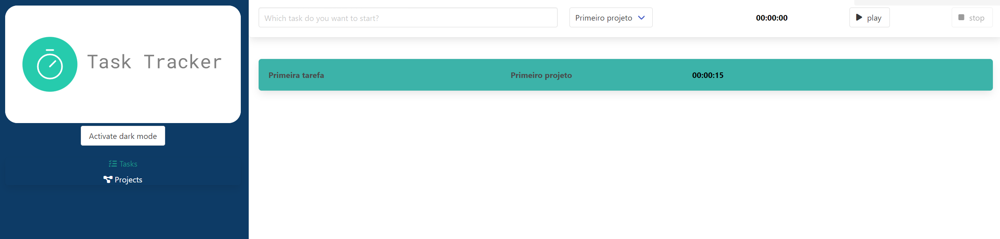

<h1 align="center">TASK TRACKER</h1>
<p align="center">
See the project here: https://tasktracker-vuejs-alura.netlify.app/
</p>



## Project setup
```
npm install
```

### Compiles and hot-reloads for development
```
npm run serve
```

### Compiles and minifies for production
```
npm run build
```

### Lints and fixes files
```
npm run lint
```

### Customize configuration
See [Configuration Reference](https://cli.vuejs.org/config/).
