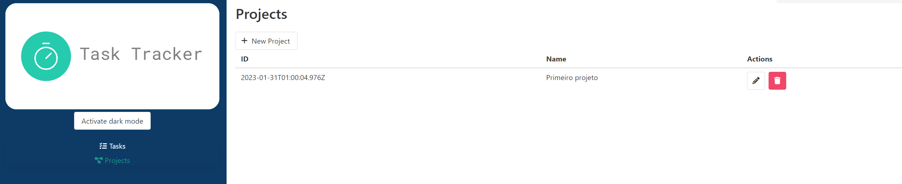

<h1 align="center">TASK TRACKER</h1>
<p align="center">
See the project here: </p>
<p align="center">
https://tasktracker-vuejs-alura.netlify.app/
</p>

## Description
This repository houses the source code of a task-timing application designed to track the time spent performing various activities. With an intuitive and easy-to-use interface, the application allows users to time the time dedicated to each task and, later, add these tasks to an organized list.

## Features

Accurate Timing: The application offers accurate timing functionality to measure the time spent on each task, ensuring detailed records.

Task Management: Users can add, edit and delete tasks from the list, making it easier to organize and track progress.

#


##



#

## Project setup
```
npm install
```

### Compiles and hot-reloads for development
```
npm run serve
```

### Compiles and minifies for production
```
npm run build
```

### Lints and fixes files
```
npm run lint
```

### Customize configuration
See [Configuration Reference](https://cli.vuejs.org/config/).
